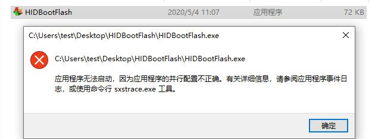

# BootHID Bootloader

目前来说，YDKB的挺多键盘使用的是这个Bootloader，免驱（使用的是系统自带的HIDUSB驱动）。

基本就是按照键盘对应的说明，按指定按键的同时插入USB线，就进入刷固件模式了。

ydkbs-reflash调用的是HIDBootFlash，参考资料：http://vusb.wikidot.com/project:hidbootflash

Source code for BootHID commandline: [https://github.com/yangdigi/BootHID/tree/master/commandline](https://github.com/yangdigi/BootHID/tree/master/commandline)

## Win下刷固件的方法

固件功能正常的时候，一般是按住键盘左上角按键不放，同时插入USB数据线，键盘进入刷机模式。这时将固件的hex文件拖到YDKB Tool.exe上，固件将自动开始刷新。刷新完成后键盘会重启。

也可以手动使用刷机工具里的bin目录内的HIDBootFlash.exe，然后进行刷新。

如果运行时提示“无法启动，并行配置不正确”，如下图，在bat界面的提示也与这个类似。

请安装VC运行库，需要的是vcredist_x86, 官方下载地址如下

<html>
Visual Studio 2005 (VC++ 8.0) SP1 
Microsoft Visual C++ 2005 Service Pack 1 Redistributable Package MFC Security Update 
<a href="http://www.microsoft.com/download/en/details.aspx?id=26347">http://www.microsoft.com/download/en/details.aspx?id=26347</a>
</html>

打开软件的界面如下：

步骤如下：
  1. 先按键盘左上角按键不放插入数据线，让键盘进入刷机模式。
  2. 点击 Find Device，会提示检测到设备。
  3. 点击 Open .hex File，选择要刷的固件。
  4. 勾上 Reboot AVR，然后点击Flash Device，等待刷新完成即可。

## Mac下刷固件的方法

使用上面的源码编译好bootloadHID，或者从群共享里下载“mac下刷固件方式\(暂行\).zip”解压得到bootloadHID，然后，

    1  chmod 755 bootloadHID
    2  brew install libusb-compat
    3  ./bootloadHID

如果这里没有出错说明可行了，也提示了使用方法

要刷固件的时候，使用

    ./bootloadHID -r hex路径

实际效果参考图片。完成是0x7c00就行了，最后出现那个Error可以不用理会。

## Win下无法正常刷固件时

这里说一下如果无法刷的时候，可能的问题。最新的刷固件软件里面已经加入了检测驱动的功能，如果提示驱动错误，按下吧操作:

1.使用zadig (下载地址：http://zadig.akeo.ie )，选择好option里面的list all，然后让键盘进入刷机模式。查看如下USB ID为16C0 05DF的设置，对应的Driver是不是HidUsb。这个设置可能显示的是名字HIDBoot，也可能只是USB输入设备。总之看对应的USB ID是下图这个才行。

上面两个图都是驱动正常的，如果这里显示的不是HidUSB，比如可能是：

这个驱动是错的，就必须要卸载了。

2.设备管理器里找到设备，非hid的，一般就显示在通用串行总线或者libusb设备等地方。找到，右键点击，选择卸载设备。

同时卸载时选中删除设备驱动

卸载后再去zadig里面查看一下，驱动是否恢复为HidUsb了，如果不是，设备管理器里面刷新一下，继续卸载（比如winusb或libusb驱动安装过多次的情况，就需要多次卸载了，直到卸载干净）。

## 补充说明

如果还有遇到特殊情况，比如怎么卸载驱动都回不到HidUSB，那就直接联系我远程处理吧。

