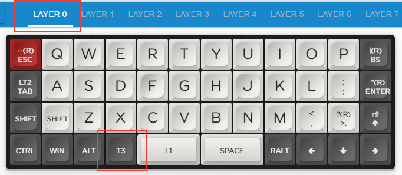

# 层开关

与瞬时开启层不同，层开关是切换一个层的开关状态，比如这个层如果是开着的，那么按一下就关闭，是关闭的则按一下就开启。

举例来说。如下图在Layer 0设置了一个按键为T3（开关层3）

然后Layer 3是这样的。

其作用就是当在第0层时，按下T3，则第3层开启，此时小键盘按键就生效了。而这里在Layer 3也放置了一个T3两个原因。
  1. 如果要回到层0，还记得最开始讲层概念就说了，层重要的是开关状态和优先级，当层3处于打开状态时，层3的优先级始终是高于层0的。因此要回到层0，是再按一次T3，关闭了层3，而不是去再设置一个T0。
  2. 如果这里什么都不设置，当层1和层2这里也是透明时，那么这个键依然是T3；如果层1和层2此处是别的按键，则层1或层2处于开启时，就没法再关闭层3了。对层熟悉之后是可以让它保持透明的。

总体来说，比起瞬时切换层，层开关在运用时多了一点注意事项。也就是设置了打开层的按键，打开了对应的层后，一定要有关闭它的手段，不要给自己搞到死胡同里去了。

